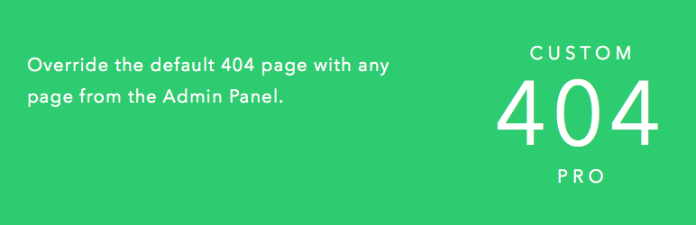
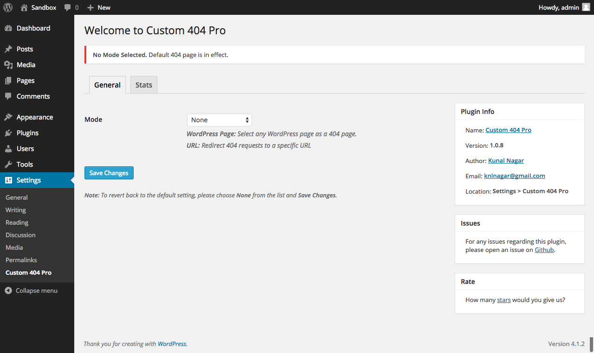

## Custom 404 Pro

Override the default 404 page with **any page** from the Admin Panel or a **Custom URL**.

### Installation

* Extract the downloaded ZIP file.
* Copy the custom-404-pro folder to the wp-content/plugins directory.
* Activate from the Plugins Section.
* Options are available under: Settings > Custom 404 Pro

### Screenshot

Here is a screenshot of the main Admin Panel where you can select a custom 404 page from the drop-down list.

### Support

Please open [issues on Github](https://github.com/kunalnagar/custom-404-pro/issues) ONLY. I will not be using the WordPress.org Support Ticket System.

### Rate

Please feel free to star on Github or [leave a rating](https://wordpress.org/plugins/custom-404-pro/).

### Donate

Like the plugin? Show your support by donating [here](http://kunalnagar.in/donate) (PayPal)

### About Me

My name is Kunal Nagar and I am a Freelance Web Developer from Jaipur, India. I build high quality websites using Core PHP, WordPress, Laravel etc. I also work on Hybrid Mobile Applications using Ionic. You can find out more about the services I provide on my [website](http://kunalnagar.in).