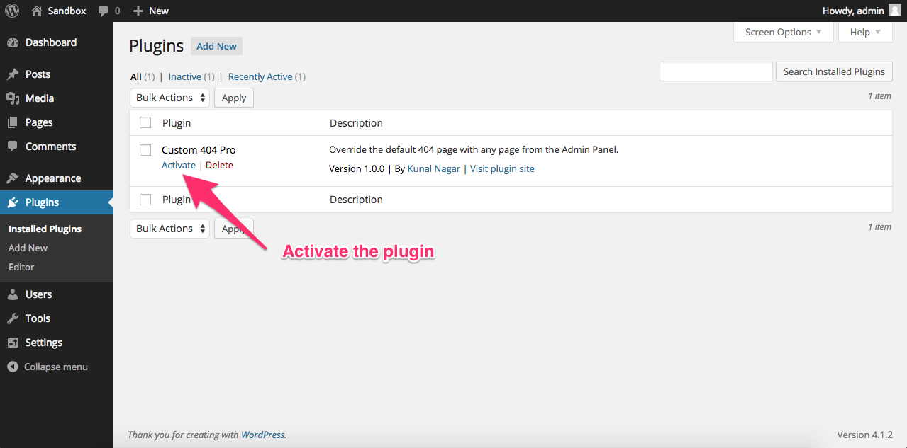
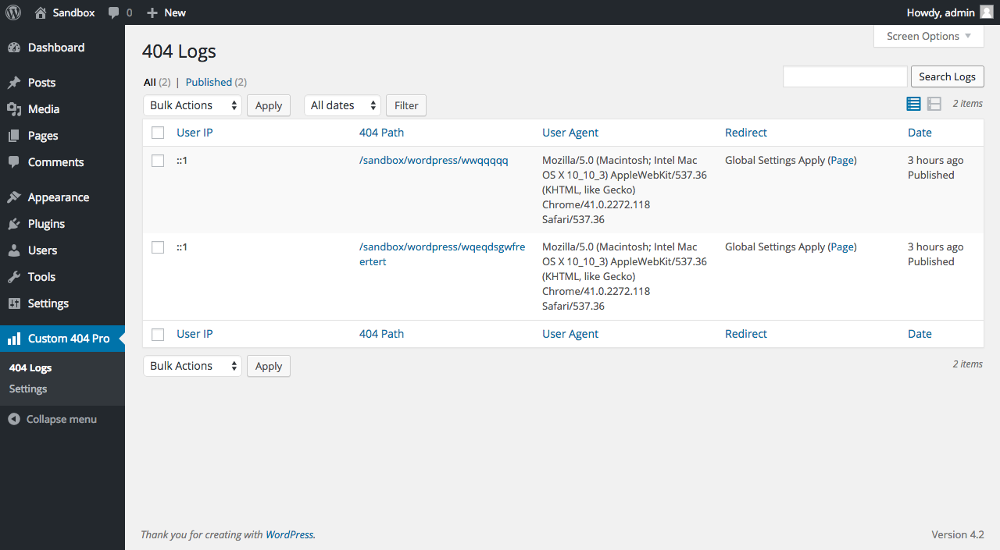
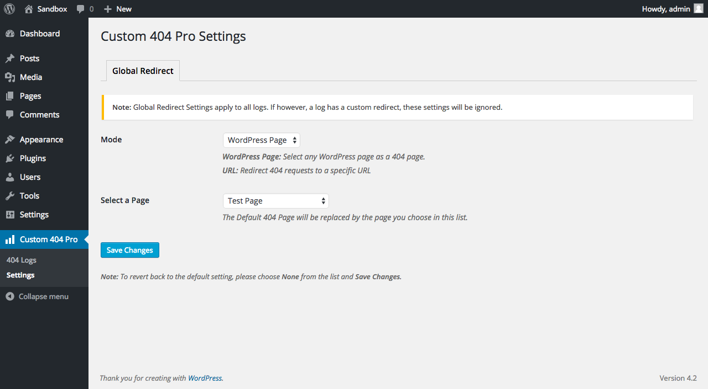

## Custom 404 Pro


Override the default 404 page with **any page** from the Admin Panel or a **Custom URL**.

### Features

* Full 404 Page Control
* Record 404 Page Data
* Custom Page Redirect
* Custom URL Redirect
* Record Visitor Keywords that led to 404
* Custom Log Filters
* Clean code
* Awesome support

### Installation

* Extract the downloaded ZIP file.
* Copy the ```custom-404-pro``` folder to the ```wp-content/plugins``` directory.
* Activate from the Plugins Section.

### Screenshots


_Activate Plugin_


_404 Logs_


_Global Settings_

### Support

Please open [issues on Github](https://github.com/kunalnagar/custom-404-pro/issues) ONLY. I will not be using the WordPress.org Support Ticket System.

### Rate

Please feel free to star on Github or [leave a rating](https://wordpress.org/plugins/custom-404-pro/).

### Donate

Like the plugin? Show your support by donating [here](https://www.paypal.me/kunalnagar/10) (PayPal)

### Changelog

You can find the full changelog [here](https://wordpress.org/plugins/custom-404-pro/changelog/)

### About Me

My name is Kunal Nagar and I am a Freelance Web Developer from Jaipur, India. I build high quality websites using Core PHP, WordPress, Laravel etc. I also work on Hybrid Mobile Applications using Ionic. You can find out more about the services I provide on my [website](http://kunalnagar.in).
