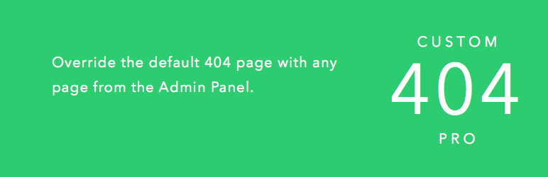
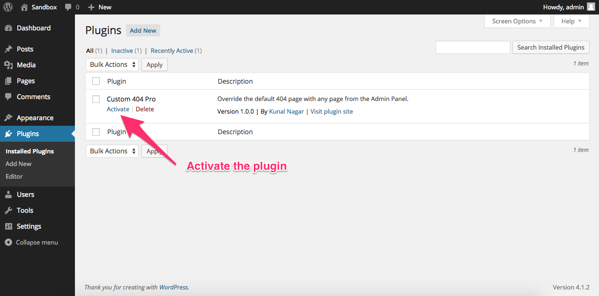
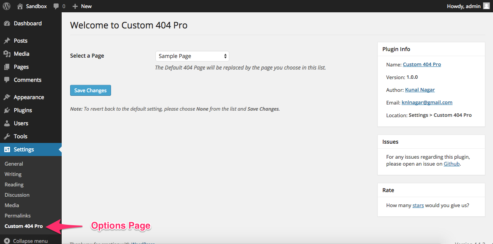
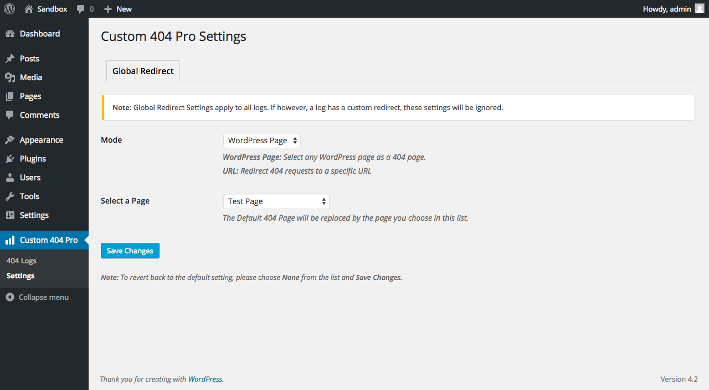

# Custom 404 Pro



Take full control of your WordPress 404 experience. Custom 404 Pro lets you redirect 404 errors to any page on your site or an external URL, log every broken URL your visitors hit, and stay notified — without getting buried in email.

---

## Features

### 404 Redirect Control

- **Redirect to a WordPress page** — choose any published page from a dropdown; it just works.
- **Redirect to a custom URL** — point 404s at any external destination.
- **Configurable HTTP status code** — choose 301, 302, 307, or 308 depending on whether the redirect is permanent or temporary.
- **Disable redirects entirely** — keep logging active without touching the 404 response.

### 404 Error Logging

- **Automatic log capture** — every 404 is recorded with the full request path, referring URL, user agent, and timestamp.
- **IP address logging** — optionally capture the visitor's IP. Disable it with one checkbox if privacy or GDPR is a concern; logged entries show `N/A` instead.
- **Searchable, sortable log table** — filter by any column directly from the Logs admin page.
- **Bulk actions** — delete selected logs, delete all logs, or export everything as a CSV file in one click.

### Email Notifications

- **Admin email alerts** — get notified at your site's admin email address whenever a 404 is logged.
- **Email cooldown** — configure a quiet period between notifications (15 minutes, 30 minutes, 1 hour, 6 hours, or 24 hours). Once an email is sent, the plugin stays quiet until the cooldown expires — no inbox flooding from bot crawls or broken redirect loops.

### Log Retention

- **Max Log Count** — set a hard cap on how many rows the log table can hold. When the table exceeds the limit, the oldest rows are automatically deleted to bring it back down. Set to `0` to disable (no limit).
- **Max Log Age (days)** — automatically delete log entries older than a given number of days. Set to `0` to keep logs forever.
- **Daily background cleanup** — a WP-Cron event runs once per day and applies both retention rules automatically. No manual intervention required.
- **On-demand pruning** — a **Prune Logs Now** button on the Logs page lets you trigger a cleanup immediately without waiting for the next cron run.
- Both limits default to `0` — existing installs see no behaviour change until retention is explicitly configured.

### Compatibility

- **Multisite** — tables and settings are provisioned per-site on activation and cleaned up per-site on uninstall.
- **Polylang & WPML** — redirect targets resolve to the correct translated page for the visitor's active language automatically.
- **Clean uninstall** — all database tables are dropped when the plugin is removed. No orphaned data left behind.

---

## Installation

1. Download the plugin ZIP from [WordPress.org](https://wordpress.org/plugins/custom-404-pro/) or clone this repository.
2. Copy the `custom-404-pro` folder to `wp-content/plugins/`.
3. Activate the plugin from the **Plugins** screen in the WordPress admin.
4. Navigate to **Custom 404 Pro → Settings** to configure your redirect and notification preferences.

> **Important:** If you ever want to remove the plugin, use **Deactivate → Delete** from the Plugins screen. Do not delete the plugin folder directly — that bypasses the uninstall routine and leaves database tables behind.

---

## Settings Reference

### Redirect Tab

| Setting | Description |
|---------|-------------|
| Mode | `None` (logging only), `WordPress Page`, or `URL` |
| Page | The WordPress page to redirect to (visible when Mode = WordPress Page) |
| URL | The external URL to redirect to (visible when Mode = URL) |

### General Tab

| Setting | Options | Default | Description |
|---------|---------|---------|-------------|
| Email | On / Off | Off | Send an admin notification email on each logged 404 |
| Email Notification Cooldown | 15 min / 30 min / 1 hour / 6 hours / 24 hours | 1 hour | Minimum time between notification emails |
| Logging Status | Enabled / Disabled | Disabled | Whether 404 events are captured to the log table |
| Log IP | On / Off | On | Whether to record the visitor's IP address |
| Redirect Code | 301 / 302 / 307 / 308 | 302 | HTTP status code used for the redirect |
| Max Log Count | Any integer ≥ 0 | 0 (disabled) | Delete oldest rows when table exceeds this count; 0 = no limit |
| Max Log Age (days) | Any integer ≥ 0 | 0 (disabled) | Delete rows older than this many days; 0 = keep forever |

---

## Screenshots

| | |
|--|--|
|  | _Activate the plugin from the WordPress admin_ |
|  | _Sortable, searchable log table with bulk actions_ |
|  | _Redirect and notification settings_ |

---

## Frequently Asked Questions

**Why is the 404 redirect not working?**

Some themes (notably Divi) intercept the request before the `template_redirect` hook fires. Try switching to a default theme to confirm the plugin is working, then re-enable your theme and check for conflicts with theme-level 404 handling.

**Why are my settings not saving after reinstallation?**

Always use **Deactivate → Delete** from the Plugins screen — never remove the plugin folder manually. Manual removal skips the uninstall routine, leaving old database tables in place. When the plugin is reinstalled, it detects the existing tables and skips seeding defaults, so you end up with stale data.

**Can I disable email notifications without disabling logging?**

Yes. Uncheck **Email** in General settings. Logging continues independently.

**How does the email cooldown work?**

After an email notification is sent, a transient is set in the WordPress object cache for the duration of the configured cooldown period. Any 404 that fires during that window skips the email send entirely. The next email goes out after the cooldown expires.

**Is this plugin GDPR-friendly?**

You can disable IP logging with the **Log IP** checkbox under General settings. When disabled, the IP column in all log entries records `N/A`. No IP data is stored or emailed.

---

## Contributing Translations

All user-facing strings use the text domain `custom-404-pro`. A Gettext template (`languages/custom-404-pro.pot`) is shipped with every release.

### Via translate.wordpress.org (recommended)

The easiest path — no git, no tooling, just a browser:

1. Create or log in to a [WordPress.org account](https://login.wordpress.org/).
2. Go to [translate.wordpress.org/projects/wp-plugins/custom-404-pro/](https://translate.wordpress.org/projects/wp-plugins/custom-404-pro/).
3. Select your locale and click **Translate**.
4. Submit suggestions for any untranslated strings.
5. A Translation Editor reviews and approves. Once a locale reaches **90% translated**, WordPress.org packages it and delivers it automatically to all users running that locale — no pull request needed.

This is the primary channel for community translations and the one most translators already use.

### Via pull request (for developers)

If you want to contribute `.po`/`.mo` files directly to the repository:

1. Copy `languages/custom-404-pro.pot` and rename it using the WordPress locale code, e.g. `languages/custom-404-pro-fr_FR.po`.
2. Open the `.po` file in [Poedit](https://poedit.net/) and fill in the `msgstr` fields.
3. Save — Poedit compiles the `.mo` binary automatically. Or compile manually:
   ```bash
   msgfmt custom-404-pro-fr_FR.po -o custom-404-pro-fr_FR.mo
   ```
4. Open a pull request adding both the `.po` and `.mo` files to `languages/`.

### Updating the .pot template

If you add new translatable strings to the plugin source, regenerate the template. This requires a running [wp-env](https://developer.wordpress.org/block-editor/reference-guides/packages/packages-env/) environment:

```bash
npx wp-env start
composer makepot
```

### Security note for reviewers

All translation PRs are checked by the `validate-translations` CI job:
- `msgfmt --check-format` validates format specifiers — catches cases where a translator removes `%d` or `%s`, which would cause a PHP `sprintf()` error at runtime
- A grep scan rejects `msgstr` lines containing `<script`, `javascript:`, `onerror=`, `<iframe`, or `eval(` — guarding the handful of description strings rendered via `wp_kses_post( __() )`

---

## Support

Open an issue on [GitHub](https://github.com/kunalnagar/custom-404-pro/issues). The WordPress.org support forum is not monitored.

## Rate & Review

If the plugin is useful to you, a [rating on WordPress.org](https://wordpress.org/plugins/custom-404-pro/) or a GitHub star goes a long way.

## Donate

Like the plugin? [Buy me a coffee via PayPal](https://www.paypal.me/kunalnagar/10).

---

## Changelog

See [WordPress.org changelog](https://wordpress.org/plugins/custom-404-pro/changelog/) for the full history.

### 3.15.0
- Add full translation support: all user-facing strings are now wrapped in i18n functions and a `.pot` template is shipped with the plugin. Includes a CI job to validate `.po` files contributed by translators.

### 3.14.1
- Fix page redirect using stale post GUID instead of current permalink, causing silent redirect failures on sites with changed domains, HTTP→HTTPS migrations, or staging-to-production deployments.

### 3.14.0
- Add configurable log retention policy: cap by row count, by age (days), or both. Includes a daily WP-Cron cleanup job and an on-demand Prune Logs Now button on the Logs page.

### 3.13.0
- Add email notification cooldown to prevent inbox flooding. Configurable from 15 minutes to 24 hours (default: 1 hour).

### 3.12.8
- Fix IP logging toggle not persisting correctly due to positional row access.

### 3.12.7
- Fix WPML/Polylang settings overwriting each other when using per-language domains.

### 3.12.6
- Add `load_plugin_textdomain` support for translations.

### 3.12.5
- Add Polylang and WPML support for the 404 redirect page.

### 3.12.4
- Enforce full WordPress coding standards: PHPDoc comments, input sanitization, file naming convention.

### 3.12.3
- Improve codebase to meet WordPress coding standards.

### 3.12.2
- Fix PHP 8.2+ dynamic property deprecation warnings.

### 3.12.1
- Security: Remediate SQL injection and CSRF vulnerabilities (CVE-2025-9947).
- Update tested up to WordPress 6.9.4.

### 3.12.0
- Support WordPress 6.6.

### 3.3.0
- Add Multisite support.

### 3.2.0
- Export logs as CSV.
- Validate URL format when URL redirect mode is selected.

### 3.1.0
- IP logging is now optional.

### 3.0.0
- Complete rewrite with a new logging mechanism and improved architecture.

---

## License

[GPLv2 or later](LICENSE.txt)
